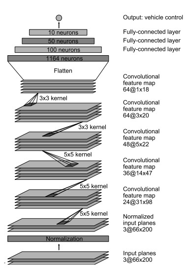
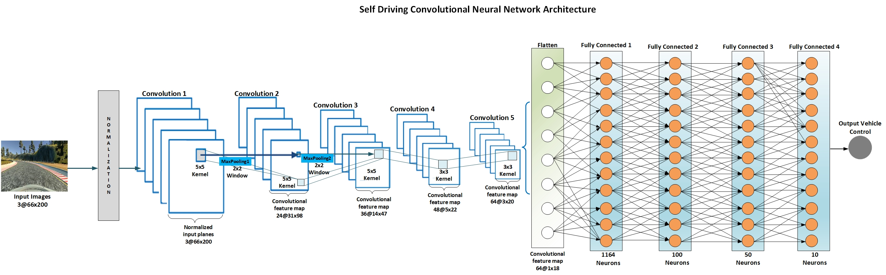
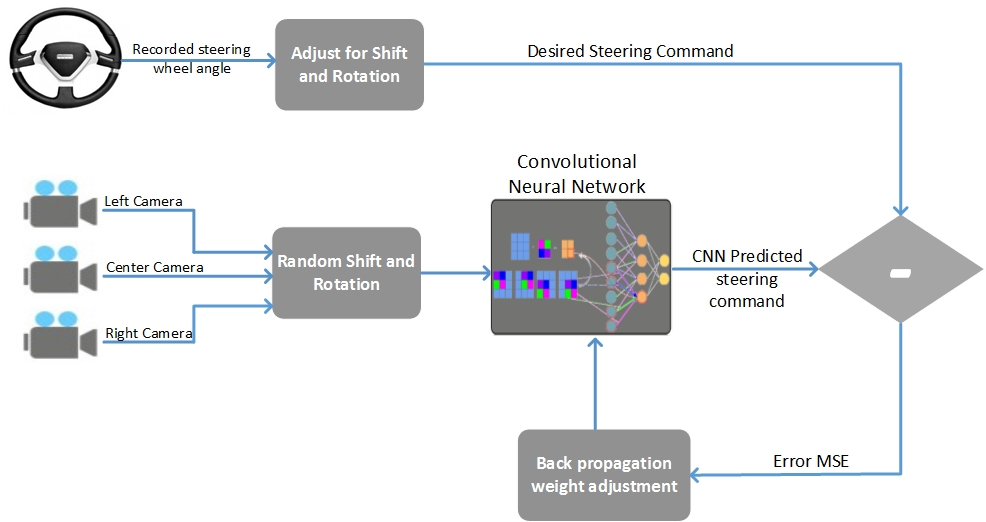
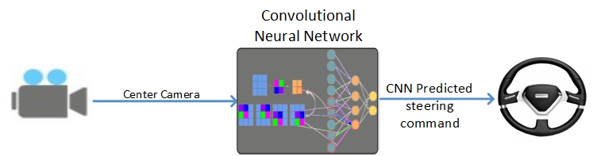

# Behavioral Cloning Project

## Introduction

The objective of the Behavioral Cloning project is to apply Deep Learning techniques to effectively teach a car to drive autonomously in a simulated driving track. The simulator includes both training and autonomous modes, and two tracks on which the car can be driven. Data be collected from both training tracks which comprises a simple track and a more challenging track which includes hills, tight turns, and other features not included in the simple track. I will refer to the simple track as the "Training track" and the second more challenging track as the "Challenging Track"

Data is genereated whilst In training mode, user generated driving data is collected in the form of simulated car dashboard camera images and control data (steering angle, throttle, brake, speed). Using the Keras deep learning framework, a convolutional neural network (CNN) model is produced using the collected driving data (see model.py) and saved as model.json (with CNN weights saved as model.h5).

Using the saved model, drive.py (provided by Udacity, but amended slightly to ensure compatibility with the CNN model and to fine tune controls) starts up a local server to control the simulator in autonomous mode. The command to run the server is python drive.py model.json; the model weights are retrieved using the same name but with the extension .h5 (i.e. model.h5).

The challenge of this project is not only developing a CNN model that is able to drive the car around the test track without leaving the track boundary, but also feeding training data to the CNN in a way that allows the model to generalize well enough to drive in an environment it has not yet encountered (i.e. the challenge track).

# The Approach

## 1. Data Collection and Processing

To ensure a successful deep learning model data collection is key to a better performing model. During generation of the data on the Training Track, I tool the following approach:

*  The car was driven in the center of the road as much as possible
*  When the car veered off to the side, it recovered back to the center
*  I generated more data by driving counter-clockwise to help the model generalize better
*  Augmenting the data by flipping the images
*  Collecting data from the **Challenging Track** to help the model generalize better

The simulator produces a csv file which includes file paths for each of these images, along with the associated steering angle, throttle, brake, and speed for each frame. My algorithm loads the file paths for all three camera views for each frame, along with the angle (adjusted by +0.15 for the left frame and -0.15 for the right), into two numpy arrays image_paths and angles. 

Images produced by the simulator in training mode are 320x160, and therefore require image resizing is required prior to being fed to the Convolutional Neural Network Model(CNN) because it expects input images to be size 200x66. To achieve this, the bottom 20 pixels and the top 35 pixels (although this number later changed) are cropped from the image and it is then resized to 200x66. A subtle Gaussian blur is also applied and the color space is converted from RGB to YUV. Because drive.py uses the same CNN model to predict steering angles in real time, it requires the same image preprocessing (Note, however: using cv2.imread, as model.py does, reads images in BGR, while images received by drive.py from the simulator are RGB, and thus require different color space conversion).

## 2. Model Architecture
I adopted my Convolutional Neural Network Architecture (CNN) from the End to End Learning for Self-Driving Cars paper and work done by Nvidia.[End to End Learning for Self-Driving Cars](https://images.nvidia.com/content/tegra/automotive/images/2016/solutions/pdf/end-to-end-dl-using-px.pdf)
The CNN goes beyond pattern recognition. It learns the entire processing pipeline needed to steer an automobile. The groundwork for this project was done over 10 years ago in a Defense Advanced Research Projects Agency (DARPA) seedling project known as DARPA Autonomous Vehicle (DAVE) [5] in which a sub-scale radio control (RC) car drove through a junk filled alley way. DAVE was trained on hours of human driving in similar, but not identical environments. The training data included video from three cameras coupled with left and right steering commands from a human operator. 

The primary motivation for this CNN architecture is to avoid the need to recognize specific human-designated features, such as lane markings, guard rails, or other cars, and to avoid having to create a collection of “if, then, else” rules, based on observation of these features. 

I then enhanced this CNN architecture by making use of the Parametric Rectified Linear Unit instead of the Rectified Linear Unit.

The image normalization was done using a Keras Lambda function, with three 5x5 convolution layers, two 3x3 convolution layers, and three fully-connected layers - and as described in the paper text - including converting from RGB to YUV color space, and 2x2 striding on the 5x5 convolutional layers. The paper does not mention any sort of Non Linearity function or means of mitigating overfitting.The intiution of using ELU on each fully-connected layer is as result of the improved performance derived from ELU. I then tried regularization to prevent overfitting by using dropout (with a keep probability of 0.5) between the two sets of convolution layers and after the first fully-connected layer. The Adam optimizer was chosen with default parameters and the chosen loss function was mean squared error (MSE). The final layer (depicted as "**Output Vehicle Control**" in the diagram) is a fully-connected layer with a single neuron.

### Regularization

Some other strategies implemented to combat overfitting and otherwise attempt to get the car to drive more smoothly are (these were implemented mostly due to consensus from the nanodegree community, and not necessarily all at once):

    Removing dropout layers and adding L2 regularization (lambda of 0.001) to all model layers - convolutional and fully-connected
    Removing tanh activations on fully-connected layers and adding ELU activations to all model layers - convolutional and fully-connected
    Adjust learning rate of Adam optimizer to 0.0001 (rather than the default of 0.001)

These strategies did, indeed, result in less bouncing back and forth between the sides of the road, particularly on the test track where the model was most likely to overfit to the recovery data.

## 3. Training the Model
Images are fed into a Convoluational Neural Network from the three cameras which then computes a proposed steering command as shown in the diagram below. The proposed command is compared to the desired command for that image and the weights of the CNN are adjusted to bring the CNN output closer to the desired output. The weight adjustment is accomplished using back propagation.

The trained network is used to generate steering commands from a single front-facing center camera.

Training a model that worked well proved to be mix between tuning model complexity and improved data collection (data quantity and quality). There is a point were the amount of data does not produce any further increase in the model performance. Similar to this research paper [Do We Need More Training Data]( http://carlvondrick.com/bigdata.pdf)

Making any changes to the model requires recompiling the model. The amount of time it takes to tune and tweek the model requires a lot of patience especially if you have limited computational resources. I trained my model on a GPU but the repetition of recompiling everytime you update model parameters took almost 10 days with 50hrs per execution cycle because of the large dataset. My focus was getting the right mix of data collection and model performance.

## Conclusion 

Creating a model that worked well proved to be quite a balance acting between tuning model complexity and improved data collection (data quantity and quality). There is a point were the amount of data does not produce any further increase in the model performance. Similar to this research paper [Do We Need More Training Data]( http://carlvondrick.com/bigdata.pdf)

Making any changes to the model requires recompiling the model and the amount of time it takes to tune and tweek the model requires a lot of patience especially if you have limited computational resources. I trained my model on a GPU but the repetition of recompiling everytime you update took almost 10 days with 50hrs per execution cycle. My focus was getting the right mix of data collection by driving in the opposite direction to help the model generalize better.

I will revist this project to include Deep Reinforcement Learning. Autonomous driving is a multi-agent setting where the host vehicle must apply sophisticated negotiation skills with other road users when overtaking, giving way, merging, taking left and right turns and while pushing ahead in unstructured urban roadways. It got me thinking how this could be implemented in combination with the German Traffic Sign Classifier.

I didn't get the opportunity to use transfer learning and try test CNN archictures such as:
1. AlexNet
2. GoogleNet
3. ResNet
4. VGGNet
